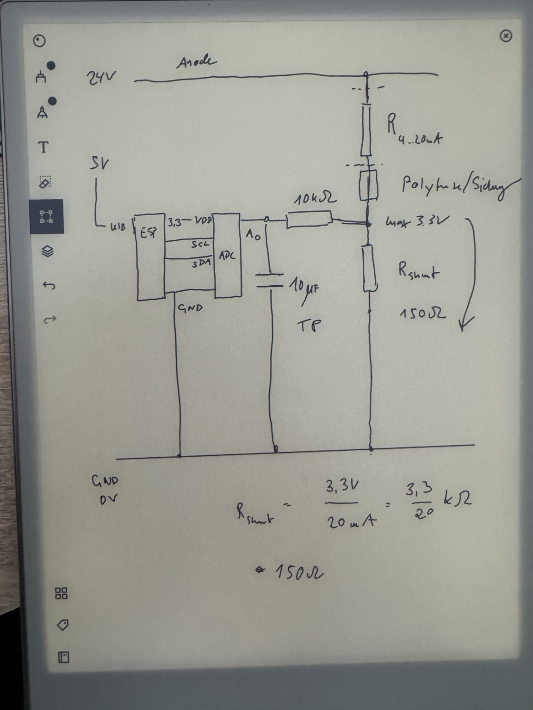
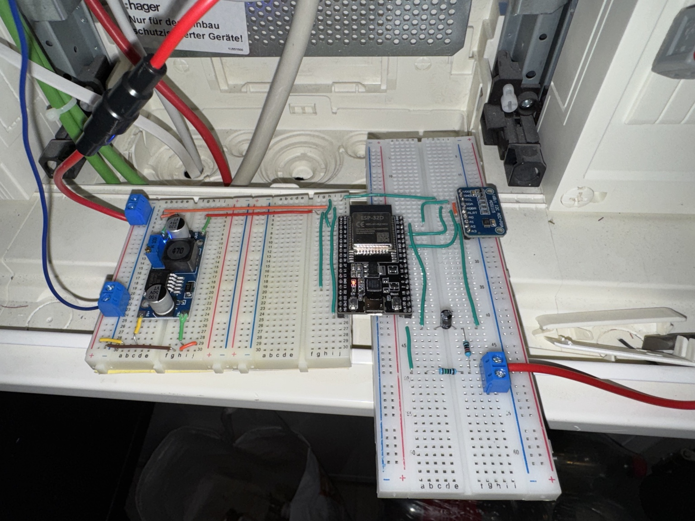

# Tank Level Sensor

ESP32-basierter Fuellstandssensor fuer einen Atlantis-7000-Tank. Das Projekt liest
eine hydrostatische 4-20-mA-Sonde ueber einen ADS1115 aus, berechnet daraus
Wasserstand und geschaetztes Nutzvolumen und stellt die Werte per HTTP als JSON
bereit.

## Status

Der aktuelle Aufbau ist ein funktionierender Breadboard-Prototyp:

- ESP32 DevKit als Controller
- ADS1115 als externer ADC am I2C-Bus
- 4-20-mA-Drucksonde im 24-V-Loop
- Shunt-Widerstand zur Strommessung
- HTTP-Endpunkt fuer aktuelle Messwerte

**Next Step:** Schaltung layouten und permanent auf Platine/Perma-Board loeten.

## Bilder

### Schaltungskonzept



Die Skizze zeigt das Messprinzip: Die 4-20-mA-Sonde haengt im 24-V-Loop. Der
Loop-Strom erzeugt am Shunt-Widerstand eine messbare Spannung, die der ADS1115
an A0 einliest. Der ESP32 versorgt und liest den ADS1115 ueber I2C.

### Breadboard-Prototyp



Der Prototyp ist aktuell auf Breadboards aufgebaut. Links sitzt die
Spannungsversorgung, mittig der ESP32, rechts der ADS1115 und die Messbeschaltung
fuer die Sonde.

> Hinweis: Die Bilddateien gehoeren nach `docs/images/schaltung-skizze.jpg` und
> `docs/images/breadboard-prototyp.jpg`.

## Messprinzip

Die hydrostatische Sonde liefert 4-20 mA fuer 0-5 m Wassersaeule. Der Strom wird
ueber einen gemessenen Shunt-Widerstand in eine Spannung umgesetzt:

```text
U_shunt = I_loop * R_shunt
I_loop  = U_shunt / R_shunt
```

Im Code ist ein gemessener Shunt-Wert von `148.3 Ohm` hinterlegt. Dadurch liegen
die erwarteten ADC-Spannungen ungefaehr in diesem Bereich:

| Loop-Strom | Bedeutung | Spannung am 148.3-Ohm-Shunt |
| --- | --- | --- |
| 4 mA | 0 m Wassersaeule | ca. 0.593 V |
| 20 mA | 5 m Wassersaeule | ca. 2.966 V |

Der ADS1115 laeuft mit `GAIN_ONE`, also einem Messbereich von +/-4.096 V. Damit
bleibt der 20-mA-Endpunkt sicher innerhalb des ADC-Bereichs.

## Hardware

| Komponente | Rolle |
| --- | --- |
| ESP32 DevKit | WLAN, HTTP-API, I2C-Master |
| ADS1115 | Praeziser externer ADC fuer die Shunt-Spannung |
| 4-20-mA-Fuellstandssonde | Hydrostatische Tankmessung, 0-5 m Wassersaeule |
| 24-V-Versorgung | Versorgung des Sensor-Loops |
| Step-Down-Wandler | Versorgung der ESP32-Seite aus der Schaltschrankversorgung |
| Shunt-Widerstand | Strom-Spannungs-Wandlung fuer die ADC-Messung |

### Verdrahtung

| Signal | Anschluss |
| --- | --- |
| ESP32 SDA | GPIO 21 |
| ESP32 SCL | GPIO 22 |
| ADS1115 Adresse | `0x48`, ADDR an GND |
| ADS1115 Kanal | A0 |
| ADS1115 Versorgung | 3.3 V |
| Gemeinsame Masse | ESP32, ADS1115 und Mess-Shunt gemeinsam referenzieren |

## Tankkalibrierung

Die Messung wird im Code auf einen Atlantis-7000-Tank abgebildet. Die nutzbare
Wasserhoehe ist mit `1.835 m` hinterlegt, das nutzbare Volumen mit `6378 l`.
Fuer die Volumenschaetzung nutzt der Code mehrere Kalibrierpunkte und interpoliert
linear zwischen ihnen. Das ist fuer diesen Tank genauer als eine rein proportionale
Umrechnung von Hoehe auf Liter.

Zentrale Werte liegen in [`include/TankConfig.h`](include/TankConfig.h).

## Firmware

Das Projekt ist ein PlatformIO-Projekt fuer `esp32dev` mit Arduino-Framework.

### WLAN konfigurieren

Lokale Zugangsdaten werden nicht versioniert. Datei kopieren und ausfuellen:

```bash
cp include/secrets.example.h include/secrets.h
```

```cpp
constexpr const char *WIFI_SSID = "...";
constexpr const char *WIFI_PASSWORD = "...";
constexpr const char *WIFI_HOSTNAME = "tank-level-sensor";
```

### Build und Upload

```bash
pio run
pio run --target upload
pio device monitor
```

## HTTP API

Nach erfolgreicher WLAN-Verbindung startet der ESP32 einen HTTP-Server auf Port
80. Per mDNS ist er unter dem konfigurierten Hostnamen erreichbar:

```text
http://tank-level-sensor.local/level
```

### `GET /`

Kurzer Text-Hinweis auf den Messendpunkt.

### `GET /level`

Liefert Rohwerte und abgeleitete Tankwerte:

```json
{
  "current_ma": 8.000,
  "voltage_v": 1.186400,
  "raw_adc": 9491,
  "raw_adc_avg": 9491.2,
  "sample_count": 20,
  "level_m": 1.250,
  "height_percent": 68.1,
  "usable_volume_l_estimate": 4775,
  "usable_volume_percent": 74.9,
  "adc_channel": 0,
  "ads_address": "0x48",
  "status": "ok"
}
```

Wenn der ADS1115 beim Start nicht gefunden wurde, antwortet der Endpunkt mit
HTTP 503 und:

```json
{"status":"ads1115_unavailable"}
```

## Projektstruktur

```text
include/
  TankConfig.h              Hardware-, Sensor- und Tankkonfiguration
  secrets.example.h         Vorlage fuer lokale WLAN-Zugangsdaten
src/
  main.cpp                  Startreihenfolge und Main Loop
  LevelSensor.cpp           ADS1115-Initialisierung und Strommessung
  TankLevelCalculator.cpp   Umrechnung in Wasserstand und Volumen
  RestApi.cpp               HTTP-Endpunkte
  WifiConnection.cpp        WLAN und mDNS
docs/images/
  schaltung-skizze.jpg      Foto der Schaltskizze
  breadboard-prototyp.jpg   Foto des aktuellen Prototyps
```

## Offene Punkte

- Schaltung vom Breadboard auf Perma-Board uebertragen
- Mechanisches Layout im Schaltschrank festlegen
- Zugentlastung und sichere Klemmen fuer 24-V-Loop und Sensorleitung vorsehen
- Shunt-Wert nach finalem Aufbau erneut messen und `LEVEL_SHUNT_RESISTOR_OHMS`
  bei Bedarf aktualisieren
- Messwerte mit realem Tankstand plausibilisieren und Kalibrierpunkte ggf.
  nachziehen
